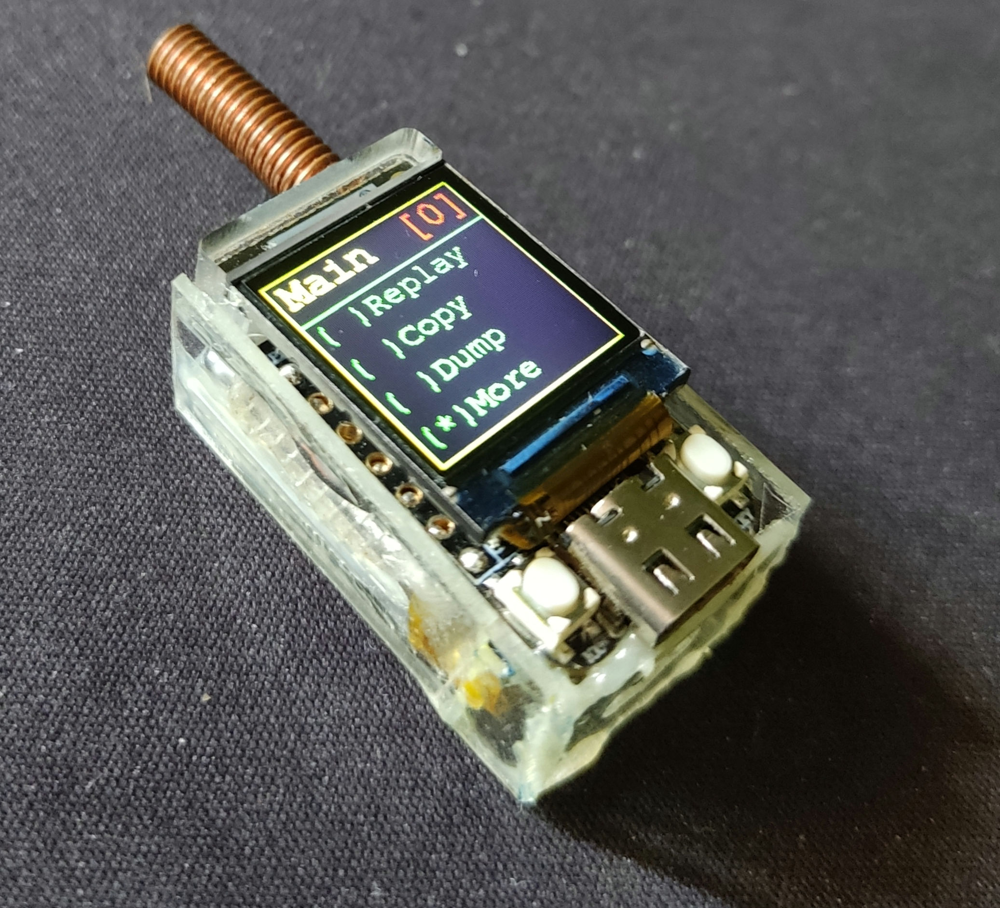
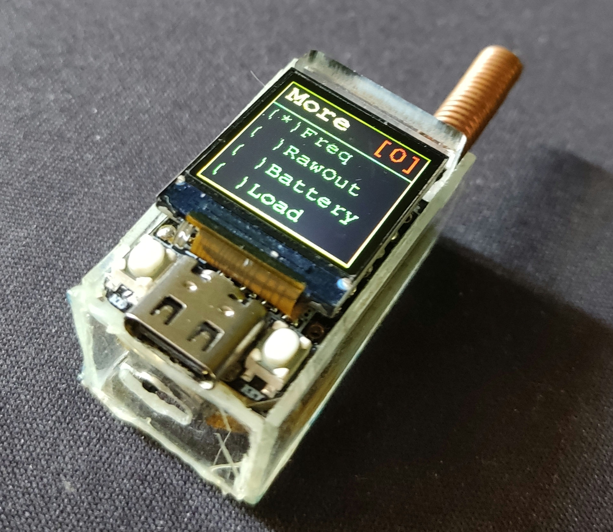

# Project TinyIO

```
  _______ _             _____ ____  
 |__   __(_)           |_   _/ __ \ 
    | |   _ _ __  _   _  | || |  | |
    | |  | | '_ \| | | | | || |  | |
    | |  | | | | | |_| |_| || |__| |
    |_|  |_|_| |_|\__, |_____\____/ 
                   __/ |            
                  |___/     
                       
```

## Description

TinyIO is an open-source Lilygo T-QT pro (esp32s3) & CC1101 based SubGHZ sniffer. 
It is based on the work of Kripthor with IO433 https://github.com/kripthor/io433
It can copy, store, replay, and dump RF signals with ASK-OOK modulation below 1ghz.
These include garage door openers, remote doorbells, sensors and similar devices.

It keeps the core values of the IO433 project being its simplicity, reliability and versatility.
With a couple of ICs and a by 'connecting some wires', or soldering a breakout board, one can start messing around with RF devices and copy their codes.
It's mainly a proof-of-concept but already encompasses several very useful features.

```bash
│  # The current dir is a platformIO project and can be imported straight from here.
├── docs     # docs and pictures
├── include  # project helper files 
├── lib    #some needed libraries with specific modifications for this project
├── libsigrokdecode   # a modified PWM decoder that shows bits and nibbles (sigrok/PulseView)
└── src # project main files
```

## Bill of Materials

| Qty. | Description | Obs. |
|------|------------------------|-----------------------------------------------------------------|
| 1 | Lilygo T-QT pro | ESP32S3 controller with a 0.85" LCD and two buttons for navigation |
| 1 | CC1101 based module for sub GHz communications | I prefer the red one (the others tend to just not work)
| 1 | Battery + switch | Optional 3.7v battery
| 1 | Material for a case | Optional 

https://github.com/Xinyuan-LilyGO/T-QT/tree/main


* All the components can be easily found in the usual online stores such as *AliExpress* ([ESP32 TTGO T-Display](https://aliexpress.com/wholesale?SearchText=ttgo+t+display+esp32)) - [CC1101](https://aliexpress.com/wholesale?SearchText=cc1101)), *Amazon*, *eBay*, etc.
* The breakout pcb and schematics files are under the docs/ directory: 
[IO433 Schematic](docs/breakout.sch)
[IO433 Board](docs/breakout.brd)


## TinyIO Wiring

Connect the CC1101 this way : 

* GDO0 to pin 33
* GDO2 to pin 38
* SCK to pin 36
* MISO (GOD1) to pin 37
* MOSI to pin 35
* CSN to pin 34


* VCC to 3V3 (VDD3V)
* GND to GND

### Assembly with battery and DIY acrylic shell




## How to flash TinyIO   

### Using [Platformio](https://platformio.org/)

* Install Visual Studio
* Install PlatformIO from the Extensions (restart)
* Install the Espressif 32 platform from the PlatformIO Embedded tab (restart)
* Check platformio.ini and chose the version of T-QT pro that you have (either 4mb flash 2mb psram or 8mb flash) 
* Clone the repository
* Connect USB-C cable to T-QT pro
* Build and upload

## How to use it

Plug the device to a battery or a to a USB-C cable. The current menu structure is the following:

```bash
│ Main
├── Copy   # Copy signal to current memory bank
├── Replay # Replay signal from current memory bank
├── Dump   # Dump current memory bank to screen and serial (fixed 100kbps, for easy analysis on third party software [ex. PulseView])
└── More
    ├── Monitor # Dump raw signal to screen and RSSI info
    ├── Raw Out # Dump current signal to serial as fast as possible (default 1Mbps serial)
    └── About   # About menu
```

## Button behaviour

* LEFT and RIGHT short press, moves between menu items
* LEFT long press is moves back a level
* RIGHT long press enters current submenu or function
* RIGHT or LEFT double press moves back and forward from memory banks (to store/replay multiple signals) 

## Dependencies

This project uses:

 * Button2 lib (which should auto-update on build via platformio.ini)
 * SmartRC-CC1101-Driver-Lib (on /lib, kripthor added minor changes for the ESP32 TDisplay)
 * TFT_eSPI (lib from https://github.com/Xinyuan-LilyGO/T-QT/tree/main)

# Improvements

There are many possibilities for improvements:

* Code refactoring. Make SimpleMenu a proper lib.
* Move to other file system to make it possible to load a file containing a custom code (instead of having user custom codes hard-coded)
* Implement other modulations besides ASK-OOK
* Add data upload to files from PC to be replayed (currently can be hard coded and loaded from LOAD menu, better than nothing)
* and so forth...

Feel free to clone and play around, as well as to contribute and make a pull request.

## Kudos

* Kripthor for most of the work https://github.com/kripthor/io433/tree/master
* [LSatan](https://github.com/LSatan), for the SmartRC-CC1101-Driver-Lib
* the [TFT_eSPI Library](https://github.com/Bodmer/TFT_eSPI)
* Shameless README.md 'template' rip from [jpdias](https://github.com/jpdias)
